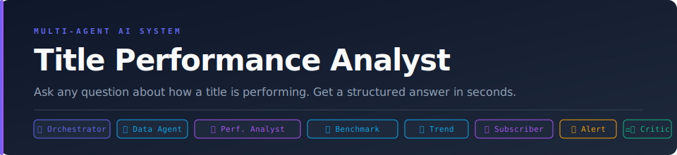

<p align="center">
  
</p>

> A fully orchestrated, multi-agent AI system for streaming title performance analysis.
> Documented publicly as it grows.

---

## What This Is

A multi-agent AI analytics platform that answers any natural language question about how a title is performing — diagnosis, benchmarking, trend analysis, genre health, subscriber behaviour, and proactive alerts.

Ask it a question in plain English. It pulls the data, analyses performance across markets and time windows, benchmarks against comparable titles, scores the quality of its own output — and returns a structured, analyst-ready answer in under 15 seconds.

**Replaces:** Screenshot → CSV export → slide deck → analyst review → meeting *(3–5 days)*
**With:** Natural language question → structured answer *(&lt;15 seconds)*

**No cloud infrastructure. No SaaS subscriptions. Runs entirely on a laptop.**

---

## The Agent Team

| Agent | Role | Model |
|---|---|---|
| 🧠 **Orchestrator** | Classifies every question into A–F, routes to specialists, synthesises the final answer | Claude Sonnet 4.6 |
| 📊 **Data Agent** | Natural language → SQL → DuckDB → structured result set | Claude Haiku 4.5 |
| 🔍 **Performance Analyst** | Core diagnosis engine — why is a title underperforming? what is its current health? | Claude Sonnet 4.6 |
| 📐 **Benchmark Agent** | Finds comparable titles, builds peer group, computes performance delta | Claude Haiku 4.5 |
| 📈 **Trend Agent** | Week-over-week momentum, day-of-week patterns, market growth signals | Claude Haiku 4.5 |
| 🎭 **Genre & Catalog Agent** | Platform-wide genre health, engagement gaps, catalog-level scoring | Claude Haiku 4.5 |
| 👤 **Subscriber Agent** | Segment behaviour, churn risk signals, acquisition attribution | Claude Sonnet 4.6 |
| 🚨 **Alert Agent** | Proactive monitoring — flags issues before anyone asks | Claude Haiku 4.5 |
| ⚖️ **Quality Critic** | Scores every output 0–10 before delivery. Enhances or rewrites if below threshold | Claude Haiku 4.5 |

---

## Architecture

```
                      ┌──────────────────────────┐
                      │       ORCHESTRATOR        │
                      │  Classifies · Routes      │
                      │  Synthesises · Delivers   │
                      └────────────┬─────────────┘
                                   │
         ┌─────────────────────────┼──────────────────────────┐
         │                         │                          │
         ▼                         ▼                          ▼
  ┌─────────────┐        ┌──────────────────┐       ┌──────────────┐
  │  DATA AGENT │        │   PERFORMANCE    │       │    ALERT     │
  │ SQL + DuckDB│        │    ANALYST       │       │    AGENT     │
  └─────────────┘        └────────┬─────────┘       └──────────────┘
                                  │
           ┌───────────────────┬──┴──────────┬──────────────┐
           ▼                   ▼             ▼              ▼
  ┌──────────────┐   ┌──────────────┐  ┌──────────┐  ┌──────────────┐
  │  BENCHMARK   │   │    TREND     │  │  GENRE & │  │  SUBSCRIBER  │
  │    AGENT     │   │    AGENT     │  │ CATALOG  │  │    AGENT     │
  │ Peer · Delta │   │ WoW · Market │  │  AGENT   │  │ Seg · Churn  │
  └──────────────┘   └──────────────┘  └──────────┘  └──────────────┘
                                   │
                      ┌────────────▼────────────┐
                      │      QUALITY CRITIC      │
                      │  Score · Enhance · Gate  │
                      └─────────────────────────┘
```

**Pattern:** Supervisor / Orchestrator — one central agent classifies and routes. No swarm. Explicit, debuggable, production-friendly.

**Quality gate:** Score ≥ 8 → deliver | 6–7 → enhance | < 6 → rewrite

---

## The 6 Question Categories

This system handles every question type across the title performance lifecycle:

| Category | Type | Example Questions |
|---|---|---|
| **A — Diagnosis** | Why is something wrong? | *"Why is [Title X] underperforming this week?"* · *"Why did viewership drop after Episode 3?"* |
| **B — Snapshot** | How is it doing right now? | *"How is [Title X] performing vs. comparable titles?"* · *"What is the completion rate by market?"* |
| **C — Trends** | What are the patterns? | *"Is [Title X] gaining or losing momentum WoW?"* · *"Which markets are growing for [Title X]?"* |
| **D — Genre & Catalog** | Platform-wide health? | *"Which genre is overperforming this month?"* · *"Which titles have high starts but low completions?"* |
| **E — Subscriber** | How are viewers behaving? | *"What segment watches [Title X] the most?"* · *"Does watching [Title X] reduce churn risk?"* |
| **F — Alerts** | What needs attention now? | *"Which titles need immediate attention this week?"* · *"Flag any title with a 30%+ WoW viewership drop"* |

---

## Tech Stack

| Layer | Technology |
|---|---|
| Language | Python 3.12 |
| Database | DuckDB 1.5.0 — ~92K rows, millisecond queries, runs locally |
| AI — Deep reasoning | Claude Sonnet 4.6 — diagnosis, subscriber analysis, orchestration |
| AI — Lightweight | Claude Haiku 4.5 — SQL generation, classification, trend, benchmarks |
| Dashboard | Streamlit — open source, no cloud required |
| Charts | Plotly — interactive visualisations |
| Terminal UI | Rich — live agent pipeline display |
| Data | Simulated — 59 titles, 10 markets, 90-day history |

---

## Project Structure

```
title-performance-agent/
│
├── agents/
│   ├── orchestrator.py          # Central routing + question classification
│   ├── data_agent.py            # SQL generation + DuckDB execution  ✅
│   ├── performance_analyst.py   # Category A + B — core diagnosis
│   ├── benchmark_agent.py       # Category B — peer group comparisons
│   ├── trend_agent.py           # Category C — WoW, momentum, markets
│   ├── genre_catalog_agent.py   # Category D — platform-wide analysis
│   ├── subscriber_agent.py      # Category E — segment + churn signals
│   ├── alert_agent.py           # Category F — proactive monitoring
│   ├── critic_agent.py          # Quality gate — score + enhance
│   └── dashboard_agent.py       # Streamlit dashboard generation
│
├── tools/
│   └── sql_tool.py              # NL → SQL → DuckDB interface  ✅
│
├── data/
│   └── generate_data.py         # Simulated streaming data generator  ✅
│
├── assets/
│   └── banner.svg               # Project banner
│
├── docs/
│   └── PHASE_LOG.md             # Phase-by-phase build log
│
├── main.py                      # Entry point — Rich terminal UI
├── CLAUDE.md                    # AI context file (auto-loaded by Claude Code)
├── requirements.txt             # All dependencies, pinned versions
├── .env.example                 # Copy to .env, add your API key
└── .gitignore
```

---

## Quick Start

### 1. Clone the repo
```bash
git clone https://github.com/Pratkashyap/title-performance-agent.git
cd title-performance-agent
```

### 2. Create virtual environment (Python 3.12 required)
```bash
python3.12 -m venv venv
source venv/bin/activate        # Mac / Linux
# venv\Scripts\activate         # Windows
```

### 3. Install dependencies
```bash
pip install -r requirements.txt
```

### 4. Add your API key
```bash
cp .env.example .env
# Open .env and add your Anthropic API key
# Get one free at: https://console.anthropic.com/
```

### 5. Generate the simulated data
```bash
python3 data/generate_data.py
```

### 6. Run the agent
```bash
python3 main.py
```

---

## Sample Queries

Once running, try these across all 6 categories:

```
# Category A — Diagnosis
> Why is [Title X] underperforming in Southeast Asia this month?
> Why did viewership drop on [Title X] after Episode 3?

# Category B — Snapshot
> How is [Title X] performing vs. comparable titles in the same genre?
> Compare [Title X] vs [Title Y] head to head across all markets

# Category C — Trends
> Is [Title X] gaining or losing momentum week over week?
> Which markets are growing fastest for [Title X]?

# Category D — Genre & Catalog
> Which genre is overperforming on the platform this month?
> Which titles have high starts but low completions right now?

# Category E — Subscriber
> What subscriber segment watches [Title X] the most?
> Does watching [Title X] reduce churn risk?

# Category F — Alerts
> Which titles need immediate attention this week?
> Flag any title whose viewership dropped more than 30% WoW
```

---

## What the Output Looks Like

```
🧠  ORCHESTRATOR
    ├─ Intent detected       diagnosis
    ├─ Category              A — why is something wrong?
    ├─ Routing pipeline      Data Agent → Performance Analyst → Critic

📊  DATA AGENT
    ├─ Query type            market_split
    ├─ Time window           last 30 days (2026-03-01 to 2026-03-31)
    ├─ SQL generated         SELECT t.title_name, v.market ...  ✓
    └─ Rows returned         240 rows  ✓

🔍  PERFORMANCE ANALYST
    ├─ Data received         240 rows across 4 SEA markets
    ├─ Model                 claude-sonnet-4-6
    ├─ Generating diagnosis...
    └─ Structured diagnosis generated  ✓

⚖️   QUALITY CRITIC
    ├─ Scoring: specificity · actionability · accuracy · tone...
    └─ Quality check complete    Score: 9/10  ✓

━━━━━━━━━━━━━━━━━━━━━━━━━━━━━━━━━━━━━━━━━━━━━━━━━━━━━━
DIAGNOSIS — [Title X] Underperformance in Southeast Asia
━━━━━━━━━━━━━━━━━━━━━━━━━━━━━━━━━━━━━━━━━━━━━━━━━━━━━━

WHAT IS HAPPENING
Completion rate in SG (38%) and TH (34%) is 28% below the Drama
genre average (53%) and well below AU performance (71%).
Drop-off is concentrated at Episode 3 — 61% of viewers who start
Episode 3 do not reach Episode 4.

ROOT CAUSE
Episode 3 pacing issue driving abandonment. Returning viewer rate
in SEA is 18% vs 41% in AU — once viewers drop off, they are not
coming back. This is a content engagement problem, not a discovery
problem (starts are on track).

RECOMMENDED ACTIONS
1. Prioritise SEA in any editorial or social push around Episode 4
   — re-engagement window is still open
2. Review Episode 3 runtime and pacing in post-mortem
3. Flag for programming team — SEA completion gap warrants clip/
   highlight strategy to bridge Ep3→Ep4
━━━━━━━━━━━━━━━━━━━━━━━━━━━━━━━━━━━━━━━━━━━━━━━━━━━━━━
```

---

## Data Notes

This project uses **fully simulated data**. No real viewership data, subscriber records, or company information is included.

The simulated dataset includes:
- 59 titles across 10 genres (Drama, Fantasy, Crime, Comedy, K-Drama, Action, and more)
- 10 APAC markets: AU, SG, HK, IN, JP, KR, TW, TH, PH, MY
- 90-day date range with realistic patterns
- Performance tiers: champions, underperformers, sleepers, at-risk, new launches
- Subscriber segments: New, Returning, Lapsed-Reactivated, At-Risk, Loyal
- Churn flags, subscription tenure, episode-level drop-off data

---

## Build Phases

```
✅  Phase 0 — Schema design + simulated data generation (59 titles, ~92K rows)
✅  Phase 1 — Data Agent + SQL tool (8/8 category tests passing)
✅  Phase 2 — Orchestrator + Performance Analyst (Category A + B)
✅  Phase 3 — Benchmark Agent + Trend Agent (Category B + C)
✅  Phase 4 — Genre & Catalog Agent (Category D)
✅  Phase 5 — Subscriber Behaviour Agent (Category E)
🔨  Phase 6 — Alert Agent (Category F)
⬜  Phase 7 — Quality Critic integration
⬜  Phase 8 — Dashboard Agent (Streamlit)
⬜  Phase 9 — End-to-end testing
```

---

## Roadmap

```
✅  V1 — Data layer + core agents (in progress)
🔨  V2 — Full 9-agent pipeline live, terminal UI complete
🔨  V3 — Streamlit dashboard with live query support
🔨  V4 — Production hardening, real data connector
🔨  V5 — Second analytics use case (same architecture, new domain)
```

This project is part of a wider series building 10 AI analytics agents on the same architecture. Each one adds a new domain while reusing the same orchestration pattern, data layer, and quality critic.

---

## Acknowledgements

Built with:
- [Anthropic Claude API](https://anthropic.com)
- [DuckDB](https://duckdb.org)
- [Streamlit](https://streamlit.io)
- [Rich](https://rich.readthedocs.io)
- [Plotly](https://plotly.com)

---

## Licence

MIT — use it, build on it, share what you make.

---

*Phase 1 complete · Documented publicly · Building in phases*
